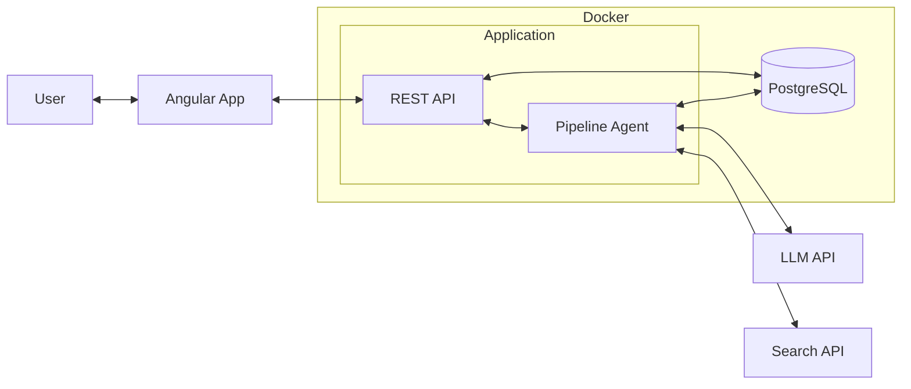

# Resume Customizer Frontend

The modern Angular 21 interface for the [Resume Customizer](https://github.com/jonkmatsumo/resume-customizer) agentic system.

This application serves as the control center for an LLM-powered pipeline that tailors LaTeX resumes to specific job postings.

## System Overview

Resume Customizer uses specialized agents to analyze job descriptions, research company values, and rewrite experience bullets. This frontend interacts with the backend agents to manage the following workflow:

| Agent | Function |
|-------|----------|
| **Requirement Extraction** | Identifies key skills and qualifications from job descriptions |
| **Company Research** | Analyzes company websites to understand tone and values |
| **Experience Selection** | Matches professional stories to job requirements |
| **Content Tailoring** | Rewrites bullet points to align with job keywords and company style |

### Architecture

The frontend communicates with a containerized Go backend which orchestrates the agentic pipeline:



> **Backend Setup Required**: This frontend requires the [Resume Customizer Backend](https://github.com/jonkmatsumo/resume-customizer) to be running locally. Follow the setup instructions in the backend repository before starting this application.

## Key Features

-   **Authentication & Profile**: Manage user identity and profile data.
-   **Employment History**: Job editor for curating your "Experience Bank"—the source of truth for the agents.
-   **Resume Generation**: 
    -   **Start Runs**: Trigger the agentic pipeline with a Job URL.
    -   **Real-time Progress**: Watch the agents work via Server-Sent Events (SSE).
    -   **Artifact Inspection**: View intermediate outputs (extracted keywords, company cultural notes).
    -   **Download**: Get the final tailored LaTeX/PDF resume.

## Docker Development (Recommended)

Ensure you have [Docker Desktop](https://www.docker.com/products/docker-desktop/) installed.

### 1. Start the Application

```bash
docker compose -f docker-compose.dev.yml up --build
```

The application will be available at: `http://localhost:4200`

### 2. Stop the Application

```bash
docker compose -f docker-compose.dev.yml down
```

## Local Development

If you prefer running without Docker:

1.  **Install Dependencies**: `npm install`
2.  **Start Server**: `npm start` (Runs on `http://localhost:4200`)
3.  **Run Tests**: `npm test -- --watch=false`

## Tech Stack

-   **Framework**: Angular 21 (Standalone Components, Signals)
-   **UI Library**: Angular Material
-   **State Management**: Signal-based Services
-   **Testing**: Vitest
